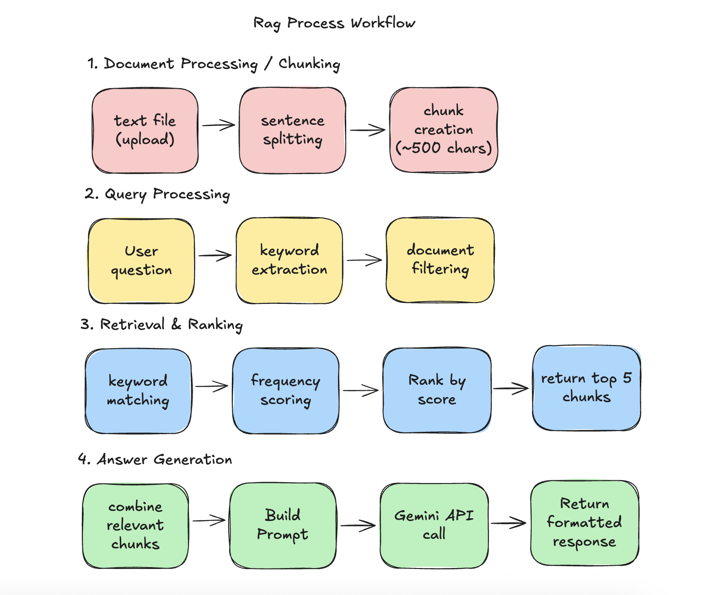

# RAG



### Backend (Node.js + Express)
- **Authentication**: JWT-based user authentication with bcrypt password hashing
- **Document Processing**: File upload with automatic text chunking for searchable content
- **Search Engine**: Keyword-based search algorithm for chunk retrieval
- **AI Integration**: Google Gemini API integration for answer generation
- **Data Storage**: JSON file-based storage

### Frontend (React + Tailwind CSS)
- **Authentication UI**: Login and registration forms
- **Document Management**: Upload interface and document list
- **Q&A Interface**: Question submission and answer display
- **Debug Tools**: Document chunk viewer for debugging and testing


## 🔧 Complete API Endpoints Reference

### Authentication Endpoints
| Method | Endpoint | Description | Auth Required | Request Body |
|--------|----------|-------------|---------------|--------------|
| `POST` | `/api/auth/register` | User registration | No | `{username, email, password}` |
| `POST` | `/api/auth/login` | User authentication | No | `{email, password}` |
| `GET` | `/api/auth/profile` | Get current user profile | Yes | None |

### Document Management Endpoints
| Method | Endpoint | Description | Auth Required | Request Body |
|--------|----------|-------------|---------------|--------------|
| `POST` | `/api/documents/upload` | Upload document file | Yes | `multipart/form-data` with file |
| `GET` | `/api/documents` | Get user's documents list | Yes | None |
| `GET` | `/api/documents/:documentId` | Get specific document details | Yes | None |
| `GET` | `/api/documents/:documentId/chunks` | Get document chunks (debug) | Yes | None |
| `DELETE` | `/api/documents/:documentId` | Delete document | Yes | None |

### Q&A System Endpoints
| Method | Endpoint | Description | Auth Required | Request Body |
|--------|----------|-------------|---------------|--------------|
| `POST` | `/api/qa/ask` | Ask question about documents | Yes | `{question, documentIds?}` |
| `POST` | `/api/qa/search` | Search document chunks | Yes | `{query}` |
| `GET` | `/api/qa/history` | Get Q&A history | Yes | None |


## 🧠 How the RAG System Works

### 1. Document Processing
When a user uploads a document:
1. **File Validation**: Accepts .txt files only (up to 10MB)
2. **Text Extraction**: Reads file content directly
3. **Chunking**: Splits text into searchable chunks (~500 characters each)
4. **Storage**: Saves chunks with unique IDs for retrieval

### 2. Retrieval Process
When a user asks a question:
1. **Query Processing**: Extracts keywords from the question
2. **Chunk Search**: Performs keyword-based search across all user's chunks
3. **Relevance Scoring**: Scores chunks based on keyword frequency
4. **Ranking**: Returns top 5 most relevant chunks

### 3. Answer Generation
After retrieving relevant chunks:
1. **Context Building**: Combines relevant chunks into context
2. **AI Integration**: Sends context and question to Google Gemini
3. **Response Processing**: Returns AI-generated answer with sources
4. **Fallback**: Provides raw context if AI service is unavailable


#### File Structure Details
```
backend/
├── config.js              # Environment configuration
├── server.js              # Express server setup
├── middleware/
│   └── auth.js            # JWT authentication middleware
├── models/
│   ├── User.js            # User data model with auth methods
│   └── Document.js        # Document model with chunking integration
├── routes/
│   ├── auth.js            # Authentication endpoints
│   ├── documents.js       # Document CRUD operations
│   └── qa.js              # Q&A and search endpoints
├── services/
│   ├── auth/
│   │   ├── jwtService.js     # JWT token management
│   │   └── validationService.js # Input validation
│   ├── llm/
│   │   ├── geminiService.js  # Google Gemini API integration
│   │   └── promptService.js  # Prompt engineering
│   ├── rag/
│   │   ├── chunkingService.js # Text chunking logic
│   │   └── searchService.js   # Keyword-based search
│   ├── response/
│   │   └── responseService.js # API response formatting
│   └── upload/
│       └── fileUploadService.js # File processing
├── data/
│   ├── users.json         # User storage (JSON)
│   └── documents.json     # Document and chunk storage
└── uploads/               # Uploaded file storage

frontend/
├── src/
│   ├── components/
│   │   ├── AuthInput.jsx      # Reusable input component
│   │   ├── AuthLayout.jsx     # Login/register layout
│   │   ├── DocumentChunks.jsx # Debug chunk viewer
│   │   ├── DocumentList.jsx   # Document listing
│   │   ├── DocumentUpload.jsx # File upload interface
│   │   └── QuestionAnswer.jsx # Q&A interface
│   ├── contexts/
│   │   └── AuthContext.jsx    # Authentication context
│   ├── hooks/
│   │   └── useAuth.js         # Authentication hook
│   ├── pages/
│   │   ├── Dashboard.jsx      # Main dashboard
│   │   ├── Login.jsx          # Login page
│   │   └── Register.jsx       # Registration page
│   ├── services/
│   │   └── api.js             # API service layer
│   └── main.jsx               # React app entry point
```

## 🚀 Quick Start
### Installation

1. **Clone and setup the project:**
```bash
git clone <repository-url>
cd rag-assignment
```

2. **Backend Setup:**
```bash
cd backend
npm install

# Create environment variables file (or use setup script)
# Start the backend server
npm start
```

3. **Frontend Setup:**
```bash
cd ../frontend
npm install

# Start the frontend development server
npm run dev
```

4. **Access the application:**
- Frontend: http://localhost:5173
- Backend API: http://localhost:3001